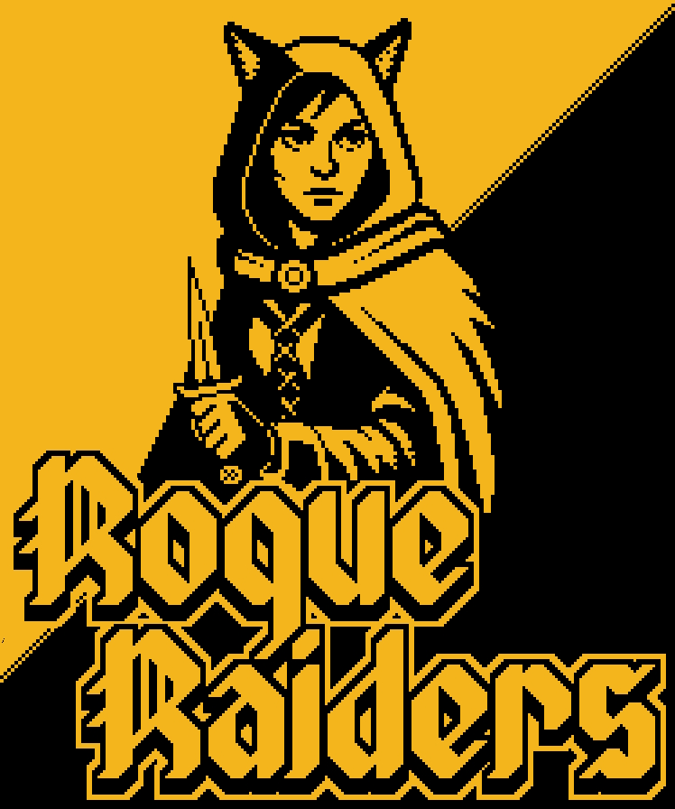
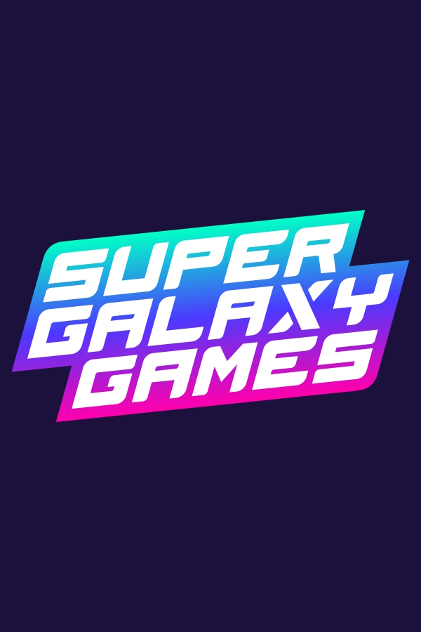
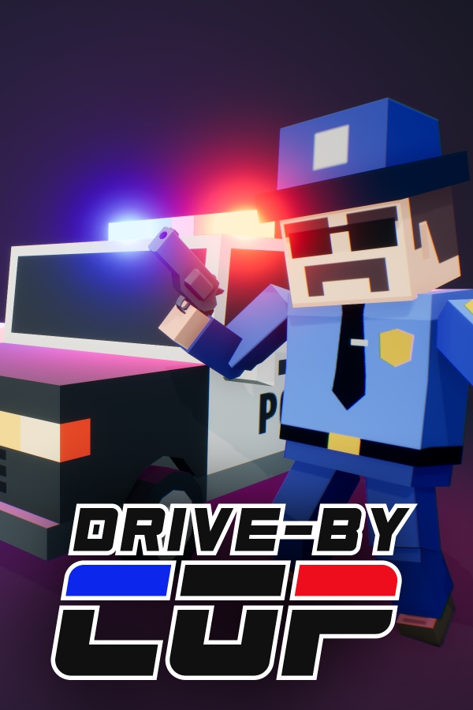

Welcome to my portfolio! Here is a selection of my games, ongoing development work, and side projects.

  <a href="assets/your-cv.pdf" target="_blank" rel="noopener noreferrer" class="btn">View CV</a>

## Games

  
  

    <h3 style="margin-top: 0;">Rogue Raiders (Work in progress)</h3>
    Private
    
A high-fantasy party platformer currently in active development. Developed in Godot with pixel art crafted in Aseprite, Rogue Raiders is a high-fantasy party platformer built around a highly flexible multiplayer architecture. The game utilizes a home made matchmaking server to support seamless cross-platform play. Designed for frictionless connectivity, the networking system features a built-in server browser, room codes, and the ability to dynamically mix local couch co-op and online players in any configuration.

    <a href="https://store.steampowered.com/app/3207620/Rogue_Raiders/" target="_blank" rel="noopener noreferrer">View on Steam</a>
  

  
  

    <h3 style="margin-top: 0;">Super Galaxy Games (Released 2025)</h3>
    qrnch Tech AB
    
This project was solo-developed by me on and off for 2 years. I made all the assets, including animations and shaders. I even acted as the announcer voice (in the finished build). It was made in Unreal Engine 5 and leverages advanced engine features like Lumen global illumination and realtime procedural mesh generation. The game features online multiplayer through Steam alongside a robust custom level editor with Steam Workshop support for sharing user-generated tracks and constructions. Although heavily optimized with a planned mobile port, the project was forced into an early release due to company closure. Consequently, several unfinished features were cut, including a dynamic powerup system featuring bombs, grappling hooks, and jetpacks.

    <a href="https://store.steampowered.com/app/2104430/Super_Galaxy_Games/" target="_blank" rel="noopener noreferrer">View on Steam</a>
  

  
  

    <h3 style="margin-top: 0;">Drive-by Cop (Released 2021)</h3>
    qrnch Tech AB
    
Another solo project developed in Unreal Engine 4. Designed for VR, Drive-by Cop is an arcade-action game centered around simultaneous driving and shooting. Playable both in VR and Desktop mode. The game supports a comprehensive range of input hardware, featuring native integration for Steam VR (Vive, Valve Index) and Oculus Touch controllers, alongside standard gamepad and mouse/keyboard options for non-VR play. Key technical implementations include cloud-saved highscore tracking and adjustable speed parameters specifically engineered to mitigate VR motion sickness, complemented by an optional interactive virtual steering wheel.

    <a href="https://store.steampowered.com/app/1324630/DriveBy_Cop/" target="_blank" rel="noopener noreferrer">View on Steam</a>
  

## Other Projects

  <video autoplay loop muted playsinline style="width: 100%; max-width: 250px; border-radius: 6px; object-fit: cover;">
    <source src="assets/patchwork.mp4" type="video/mp4">
    Your browser does not support the video tag.
  </video>
  

    <h3 style="margin-top: 0; margin-bottom: 6px;">Patchwork (Work in progress)</h3>
    Private
    
Developed in Rust and inspired by MarkovJunior, Patchwork is a highly optimized procedural generation toolkit designed for building complex, logic-based game environments and data structures. Originally conceived as a dedicated Markov operations library, the project has evolved into a versatile, high-performance ecosystem featuring its own custom language parser. The suite is divided into two core components: a dedicated visual editor for authoring and debugging generation scripts, and a soon-to-be open-source runtime library built for frictionless integration into modern game engines.

  

---

  
Want to get in touch?

  <a href="mailto:chr.e@live.se">Email Me</a>
  
  

    <a href="https://github.com/ChristofferEnne" target="_blank" rel="noopener noreferrer" style="margin: 0 15px; text-decoration: none;">GitHub</a> &bull;
    <a href="https://x.com/HelloNybble" target="_blank" rel="noopener noreferrer" style="margin: 0 15px; text-decoration: none;">X</a> &bull; 
    <a href="https://www.twitch.tv/hellonybble" target="_blank" rel="noopener noreferrer" style="margin: 0 15px; text-decoration: none;">Twitch</a>
  

